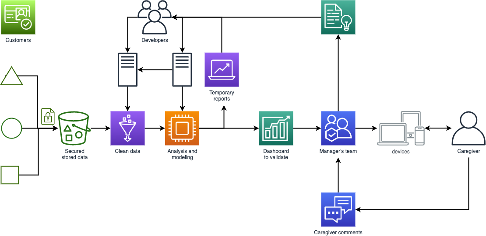
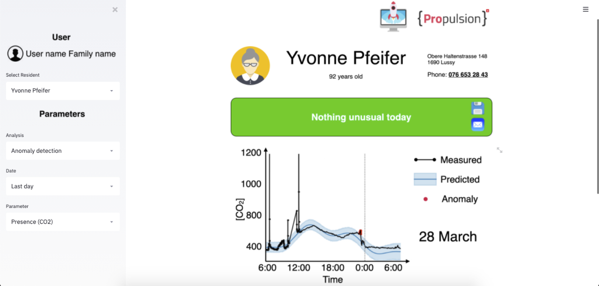
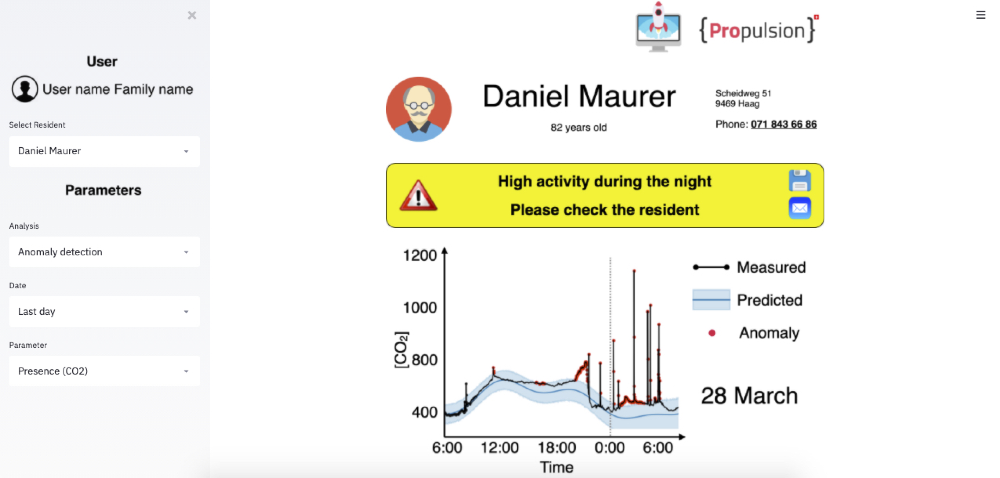

# Human Activity Prediction from ambient sensor's data

[Overview](Overview.png)

*Capstone project realised during the Data Science bootcamp at the Propulsion Academy (02/2020).*

Collaboration with Christophe Bousquet and Juhyun Schoebi.

## Background:
Human activity patterns can be derived from different sensors like CO2, temperature, noise, etc. For instance, the presence of person can be detected by measuring the ambient concentration of CO2. Quantifying how often a person opens or closes a windows can be derived from light, temperature or humidity data.

***
## Project Goals : Find patterns in the sensor signals that correlate with a person's activity.

***

## Objectives :
This project focuses on analysing data derived from sensors deployed in households. The goal is to find patterns in the sensors' signals that correlate with a person's activity. If irregularities are detected, an app processing the ambient environmental data actively notifies the caregivers.

## Milestones:
**Milestones 1**: Normalize the data, identify patterns, detect certain activities.

**Milestones 2**: Real-time activity reporting every 15 - 30 minutes. Be able to detect an activity (and maybe the type of activity) and send a notification.

## Data:
Light, temperature, humidity and CO2 were time series of ambient values measured every 20sec using a sensor located in the room of a resident.

## Results
### Workflow

The ambient sensor data is collected and securely transfered to a cloud for cleaning, preprocessing and analysis. A dashboard validated by the UX team is accessible to caregivers, allowing them if they need to proceed to a resident checking.

### Illustrations
For each resident, an individual dashboard shows the user (left side) and resident (right side) information:
- The user section is dedicated to identify the caregiver, analysis mode, time frame and parameter used for activity detection.
- The resident section shows the contact details, summary of data analysis and data illustration.

Below are shown simulated cases, where two residents exhibited a usual and unual activity, respectively.

*How does it work ?*

Ederly peoples tend to exhibit the same routine over days and weekdays. Waking up, going out for a walk or nightly bathroom breaks occur generally at the same time of the day and the week. Therefore, processing the data from previous days allows for predicting the expected behavior of a resident (eg presence in a room from the CO2 concentration data) and anomalies can be detected by comparing the predicted behavior with measured data.
The measured and predicted data are shown in black and blue on the graph, respectively. Anomalies are shown in red. The dashboard allows the caregiver to check if the resident exhibited an unusual behavior and decide if he should check him/her.

A summary of our results was presented during a meetup webinar:

### AI Canvas
**Skills**: Time-series analysis of data. Clustering - pattern analysis

**Output**: Analysis report of activity. Dashboard for a patient-specific overview

**Value Proposition**: Tells the caregiver/family if a resident is behaving normally or exhibit an abnormal activity. Detects persons in need of help. This is especially valuable when caregivers need to check a high number of person, allowing them to
- get notified in real time when a resident exhibits an abnormal behavior,
- prioritize individual resident visits and organize their work

**Integration**: Dashboard accessible through a web interface

**Customers**: Caregivers, family member, person in charge to provide medical help

## Code structure

**`1_exploration`**: Exploratory data analysis. 2D and 3D plots of time-series.

**`2_forecasting`**: Anomaly detection using time-series forecasting using Prophet from facebook. Possibility to run a single instance, or let the script determine the best parameters for prediction: it will try several numbers of days for the training (this was the most critical parameter to my experience), sort the results according to the mean average percentage error and save the best Prophet result. 

**`2_forecasting_GridSearch`**: This script aims to check if the script is relevant for production. A loop to run the script on a random sample of days (eg 10 days per device, user-defined), to be able to check if the script works with all kind of results.

**`3_dashboard`**:  Remote Monitoring Solution based on a web interface dedicated to the caregivers to inform and alert on the patient activities.
